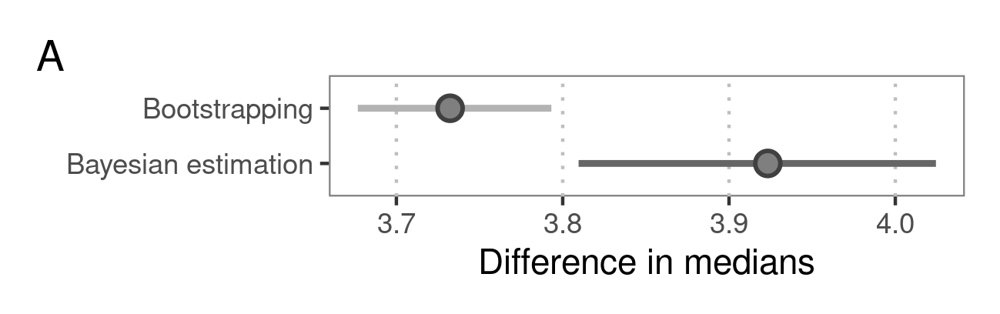
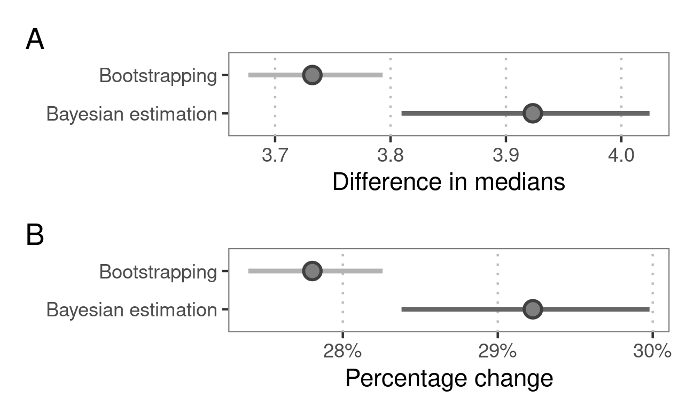
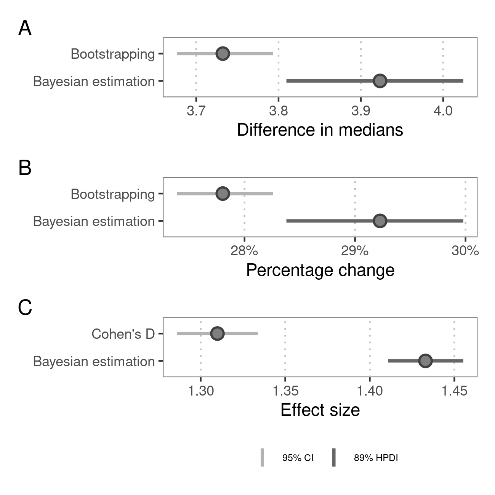

class: bg_karl
## Deep-time climate legacies affect origination rates of marine genera


#### Gregor Hans Mathes <br> Wolfgang Kiessling <br> Manuel Jonas Steinbauer
  

.footnote[
2nd Crossing the Palaeontological – Ecological Gap  
8th September 2021  
Museum für Naturkunde Berlin
]


  
---
class: center
## About me  

.pull-left[
<!--  -->

] 

--

PhD Student  

Tersane  

--

----

Conservation Palaeobiology  
  
Environmental Data Science  

--

----    

Complex interactions of life and climate  
  
Palaeoclimate Interactions  
  


```{r setup, include=FALSE}
options(htmltools.dir.version = FALSE)
library(tidyverse)
```
```{css, echo = F}
.bg_karl {
  position: relative;
  z-index: 1;
}

.bg_karl::before {    
      content: "";
      background-image: url('https://cdn.pixabay.com/photo/2017/02/01/10/23/coral-2029448_960_720.png');
      background-size: cover;
      position: absolute;
      top: 0px;
      right: 0px;
      bottom: 0px;
      left: 0px;
      opacity: 0.1;
      z-index: -1;
}

.remark-slide-number {
  display: none;
}
```

```{r xaringan-themer, include=FALSE, warning=FALSE}
library(xaringanthemer)
style_duo_accent(
  primary_color = "#841F27",
  secondary_color = "#354E71",
  text_font_google  = google_font("Spectral", "300", "300i"),
  code_font_google = google_font("Karla"), 
  text_font_size = "1.18rem" 
)
```  
  
```{r xaringanExtra-search, echo=FALSE}
xaringanExtra::use_search(show_icon = FALSE, 
                          case_sensitive = FALSE)
```  
  
```{r xaringan-tile-view, echo=FALSE}
xaringanExtra::use_tile_view()
```  

```{r xaringan-animate-css, echo=FALSE}
xaringanExtra::use_animate_css()
```


---
## Paleoclimate Interaction

```{r temperature data, echo= FALSE}
temp_dat <- tibble(x = 1:100, y = c(1:70, 71:42)) %>% 
  mutate(x = rnorm(x, x, 2), 
         y = rnorm(y, y, 2)) %>% 
  add_column(col_group = c(rep("Long-term Trend", 70),
                           rep("Short-term Change", 30)))
```

.center[
```{r paleoclimate interaction plot 1, echo=FALSE, fig.width=12}
temp_dat %>% 
  ggplot(aes(x, y)) +
  geom_point() +
  labs(x = "Time", y = "Temperature") +
  scale_x_continuous(breaks = NULL) +
  scale_y_continuous(breaks = NULL) +
  theme_minimal(base_size = 20) +
  theme()
```  
]  

---
class: animated fadeIn
## Paleoclimate Interaction

.center[
```{r paleoclimate interaction plot 2, echo=FALSE, message=FALSE, fig.width=12}
temp_dat %>% 
  ggplot(aes(x, y)) +
  geom_point() +
  geom_smooth(aes(colour = col_group), 
              se = FALSE, 
              method = "lm") +
  ggforce::geom_mark_ellipse(aes(label = col_group, 
                                 colour = col_group), 
                             label.fontsize = 20, 
                             label.colour = "grey20") +
  labs(x = "Time", y = "Temperature") +
  scale_color_manual(values = c("#841F27", "#354E71")) +
  scale_x_continuous(breaks = NULL) +
  scale_y_continuous(breaks = NULL) +
  theme_minimal(base_size = 20) +
  theme(legend.position = "none")
```  
]

---

## Background  

<br>

Various ecological concepts state that **climatic context** matters for evolutionary dynamics  

--


- niche conservatism<sup>1</sup>  

--

- migration lags<sup>2</sup> 

--

- cascading effects<sup>3</sup>  
 

.footnote[
[1] [Wiens & Graham 2005](http://wienslab.com/Publications_files/Wiens_Graha_m_AnnRev2005.pdf), 
[Hopkins et al. 2014](https://onlinelibrary.wiley.com/doi/pdf/10.1111/ele.12232)  
[2] [Svenning & Skov 2004](https://onlinelibrary.wiley.com/doi/pdf/10.1111/j.1461-0248.2004.00614.x?casa_token=FUNth791jy8AAAAA:3VxiavZdDNQNpkHW6ubiq7BbbMhxZnPvsbMaNksoP3VIDjxfAm132-6hoOb0jVG2XUCPFls8U_UNCQpc), 
[Normand et al. 2011](https://royalsocietypublishing.org/doi/full/10.1098/rspb.2010.2769)  
[3] [Beaugrand 2015](https://royalsocietypublishing.org/doi/pdf/10.1098/rstb.2013.0264), 
[Lord et al. 2017](https://www.int-res.com/articles/feature/m571p001.pdf)
]

---
class: center, middle, animated slideInLeft

  


---
## Recent work 

Biodiversity &#8594; High Impact<sup>1</sup>

Extinction &#8594; High Impact<sup>2</sup>

.footnote[
[1] [Antão et al. 2020, *Nature Ecology and Evolution*](https://www.nature.com/articles/s41559-020-1185-7)

[2] [Mathes et al. 2021a, *Nature Ecology and Evolution*](https://www.nature.com/articles/s41559-020-01377-w)
]

--

# **Origination &#8594; ???**

---
## New publication  
  
- [Mathes et al. 2021b, *PNAS*](https://www.pnas.org/content/118/36/e2105769118)
  
- [Twitter Thread](https://twitter.com/GregorMathes/status/1433723582333530125)  
  
- [Press Release](https://www.uni-bayreuth.de/en/university/press/press-releases/2021/115-evolution-climate-change/index.html)  
  
- [Supplementary Information](https://www.pnas.org/content/pnas/suppl/2021/09/02/2105769118.DCSupplemental/pnas.2105769118.sapp.pdf)

---
### Origination response

```{r origination responce, echo=FALSE, fig.width=10}
load("data/violin_plot_data.RData")

av <- 0.13

ggplot(prob, aes(x=pal.int, y=ori.prob, fill=pal.int)) + 
  geom_hline(yintercept = av)+
  geom_violin(fill = NA, colour = NA) +
  scale_y_continuous(name = "Origination Probability", limits=c(0, 0.3), 
                     breaks = seq(0, 0.3, by= 0.05), 
                     labels = scales::percent_format(accuracy = 1)) +
  xlab(NULL) +
  theme_minimal() +
  theme(legend.position = "none", 
        axis.ticks.length.x.bottom = unit(0.25, "cm"), 
        axis.title = element_text(size = 15), 
        axis.text = element_text(size = 15)) +
  # add arrows
  annotate(geom = "curve", x = 4, y = 0.22,  # overall
           xend = 4.45, yend = 0.138, 
           curvature = -.325, arrow = arrow(length = unit(2.5, "mm")), 
           colour = "grey40") +
  # add lines
  annotate(geom = "segment", x = 4, y = 0.22, # overall
           xend = 4.55, yend = 0.22, colour = "grey40") +
  # add background box
  annotate(geom = "rect", xmin = 4, xmax = 4.5, # overall
           ymin = 0.235, ymax = 0.26, fill = "white") +
  # add text
  annotate(geom = "text", x = 4.275, y = c(0.25, 0.235), # overall
           colour = "grey30", label = c("Overall", "median"), size = 4.5) +
  scale_x_discrete(labels = c("Cooling-Cooling", "Cooling-Warming", 
                              "Warming-Cooling", "Warming-Warming"), 
                   guide = guide_axis(n.dodge=2))

```

---
class: animated fadeIn
### Origination response

```{r origination responce full, echo=FALSE, fig.width=10}
ggplot(prob, aes(x=pal.int, y=ori.prob, fill=pal.int)) + 
  geom_hline(yintercept = av)+
  geom_violin() +
  scale_fill_manual(values = c("#354E71", "#354E71","#841F27", "#841F27"))+
  scale_y_continuous(name = "Origination Probability", limits=c(0, 0.3), 
                     breaks = seq(0, 0.3, by= 0.05), 
                     labels = scales::percent_format(accuracy = 1)) +
  xlab(NULL) +
  theme_minimal() +
  theme(legend.position = "none", 
        axis.ticks.length.x.bottom = unit(0.25, "cm"), 
        axis.title = element_text(size = 15), 
        axis.text = element_text(size = 15)) +
  # add half a violin to visualise palaeoclimate interactions
  ggnewscale::new_scale_fill() +
  see::geom_violinhalf(data = filter(prob, pal.int == "CW" | pal.int == "WC"), 
                       aes(colour = pal.int, fill = pal.int)) +
  scale_fill_manual(values = c("#841F27", "#354E71")) +
  scale_colour_manual(values=c("#841F27", "#354E71")) +
  # add grey lines to visualise medians per group 
  stat_summary(fun = median, fun.min = median, fun.max = median,
               geom = "crossbar", width = c(0.915, 0.35, 0.53, 0.42), 
               colour = "grey60") +
  # add outer layer
  geom_violin(fill = NA) +
  # add arrows
  annotate(geom = "curve", x = 4, y = 0.22,  # overall
           xend = 4.45, yend = 0.138, 
           curvature = -.325, arrow = arrow(length = unit(2.5, "mm")), 
           colour = "grey40") +
  annotate(geom = "curve", x = 1.25, y = 0.055, # per group
           xend = 0.68, yend = 0.146, 
           curvature = -.5, arrow = arrow(length = unit(2.5, "mm")), 
           colour = "grey40") +
  # add lines
  annotate(geom = "segment", x = c(4, 1.25), y = c(0.22, 0.055), # overall
           xend = c(4.55, 0.575), yend = c(0.22, 0.055), colour = "grey40") +
  # add background box
  annotate(geom = "rect", xmin = 4, xmax = 4.5, # overall
           ymin = 0.235, ymax = 0.26, fill = "white") +
  # add text
  annotate(geom = "text", x = 4.275, y = c(0.25, 0.235), # overall
           colour = "grey30", label = c("Overall", "median"), size = 4.5) +
  annotate(geom = "text", x = 0.9, y = c(0.045, 0.03, 0.015), # per group
           colour = "grey30", label = c("Median", "per", "group"), size = 4.5) +
  scale_x_discrete(labels = c("Cooling-Cooling", "Cooling-Warming", 
                              "Warming-Cooling", "Warming-Warming"), 
                   guide = guide_axis(n.dodge=2))

```


---
class: animated slideInLeft

### Effect size
.center[

]

---
class: animated fadeIn
### Effect size

.center[

]

---
class: animated fadeIn
### Effect size

.center[

]

---
### Effect per group
```{r log odds empty, echo=FALSE, fig.width=10, warning=FALSE}
load("data/log_odds_impr.RData")

log_odds_impr %>% 
  # reorder labels
  mutate(name = as_factor(name)) %>% 
  mutate(name = fct_reorder(name, desc(name))) %>% 
  ggplot(aes(x = estimate, y = name)) +
  geom_vline(xintercept = 0, colour = "darkred") +
  geom_point(aes(fill = type), size = 2, shape = 21, stroke = 0.5, colour = NA, fill = NA ) +
  theme(panel.background = element_rect(fill = "white", colour = "grey50"),
        panel.grid.major.x=element_line(colour = "grey", linetype = "dotted"),
        text = element_text(family = "sans"), 
        legend.position = "none", 
        panel.grid.major.y = element_blank(), 
        panel.grid.minor.x = element_blank(), 
        axis.title = element_text(size = 15), 
        axis.text = element_text(size = 15)) + 
  labs(x= "Log Odds ratio \n (Origination | Cooling-Cooling)", y = NULL)+
  scale_x_continuous(breaks = seq(0, 4, by = 1)) +
  # add annotations
  # box
  annotate(geom = "rect", xmin = 0.4, xmax = 1.65, 
           ymin = - 0.6, ymax = 0.4, fill = "white") +
  # text
  annotate(geom = "text", x = 0.9, y = -0.1,
           colour = "grey30", label = "increasing likelihood", size = 4.5) +
  # arrow
  annotate(geom = "segment", x = 1.45, y = -0.1,  
           xend = 1.7, yend = -0.1, arrow = arrow(length = unit(2, "mm")), 
           colour = "grey40", size = 0.35) +
  coord_cartesian(xlim = c(0, 4), ylim = c(-0.05, 14)) +
  scale_fill_manual(values = c("grey40", "#d5a069", "indianred"))
```

---
class: animated fadeIn
### Effect per group
```{r log odds full, echo=FALSE, fig.width=10, warning=FALSE}
log_odds_impr %>% 
  # reorder labels
  mutate(name = as_factor(name)) %>% 
  mutate(name = fct_reorder(name, desc(name))) %>% 
  ggplot(aes(x = estimate, y = name)) +
  geom_linerange(aes(xmin = lower_CI, xmax = upper_CI)) +
  geom_vline(xintercept = 0, colour = "darkred") +
  geom_linerange(aes(xmin = lower_CI, xmax = upper_CI),
                 size = 1, colour = "grey45") +
  geom_point(aes(fill = type), size = 4, shape = 21, stroke = 0.5, colour = "grey25" ) +
  theme(panel.background = element_rect(fill = "white", colour = "grey50"),
        panel.grid.major.x=element_line(colour = "grey", linetype = "dotted"),
        text = element_text(family = "sans"), 
        legend.position = "none", 
        panel.grid.major.y = element_blank(), 
        panel.grid.minor.x = element_blank(), 
        axis.title = element_text(size = 15), 
        axis.text = element_text(size = 15)) + 
  labs(x= "Log Odds ratio \n (Origination | Cooling-Cooling)", y = NULL)+
  scale_x_continuous(breaks = seq(0, 4, by = 1)) +
  # add annotations
  # box
  annotate(geom = "rect", xmin = 0.4, xmax = 1.65, 
           ymin = - 0.6, ymax = 0.4, fill = "white") +
  # text
  annotate(geom = "text", x = 0.9, y = -0.1,
           colour = "grey30", label = "increasing likelihood", size = 4.5) +
  # arrow
  annotate(geom = "segment", x = 1.45, y = -0.1,  
           xend = 1.7, yend = -0.1, arrow = arrow(length = unit(2, "mm")), 
           colour = "grey40", size = 0.35) +
  coord_cartesian(xlim = c(0, 4), ylim = c(-0.05, 14)) +
  scale_fill_manual(values = c("grey40", "#d5a069", "indianred"))
```
---
class: bg_karl
### Summary
  
<br/>  
  
.footnote[
Twitter: [@GregorMathes](https://twitter.com/GregorMathes)  
Website: [gregor-mathes.netlify.app](https://gregor-mathes.netlify.app/)
]

--

- **high impact of palaeoclimate interactions on origination**
  
--

- **higher origination signal after cooling-cooling**

--

- **effect consistent in groups and through time**

--
