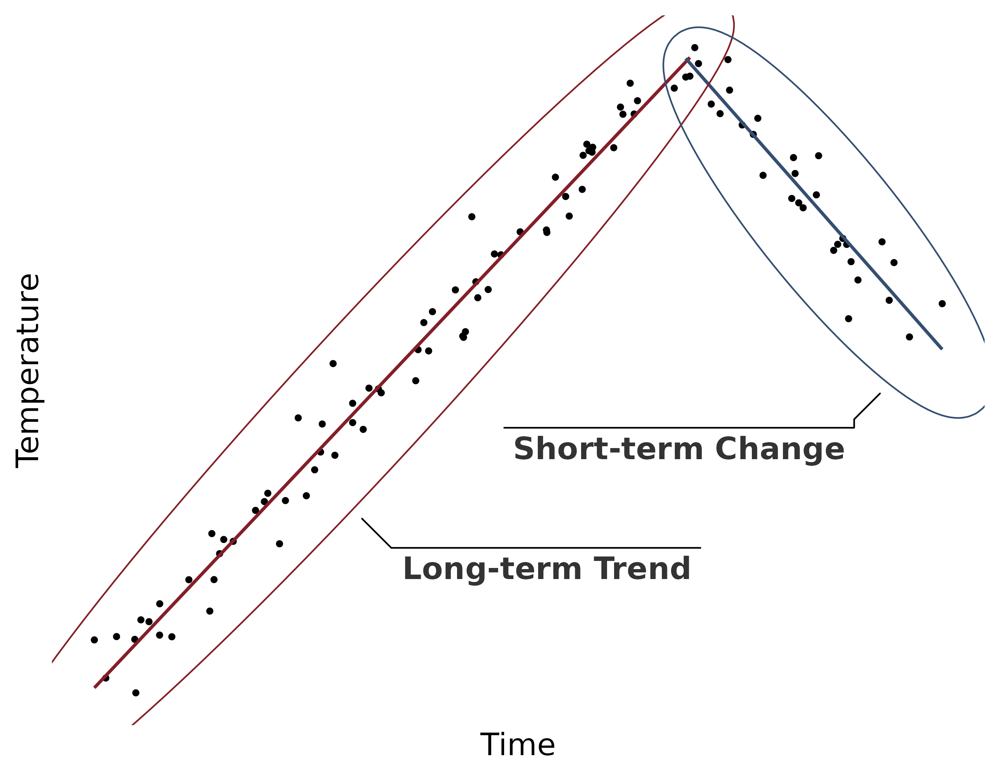
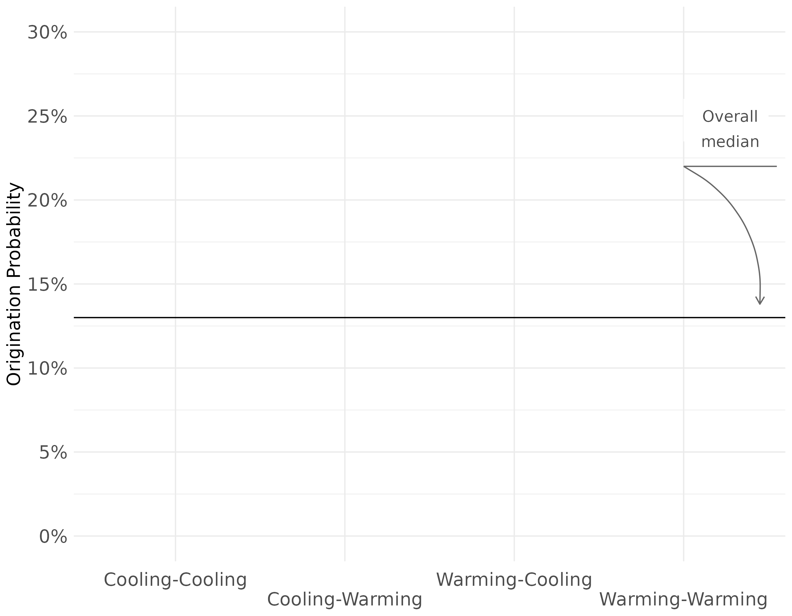
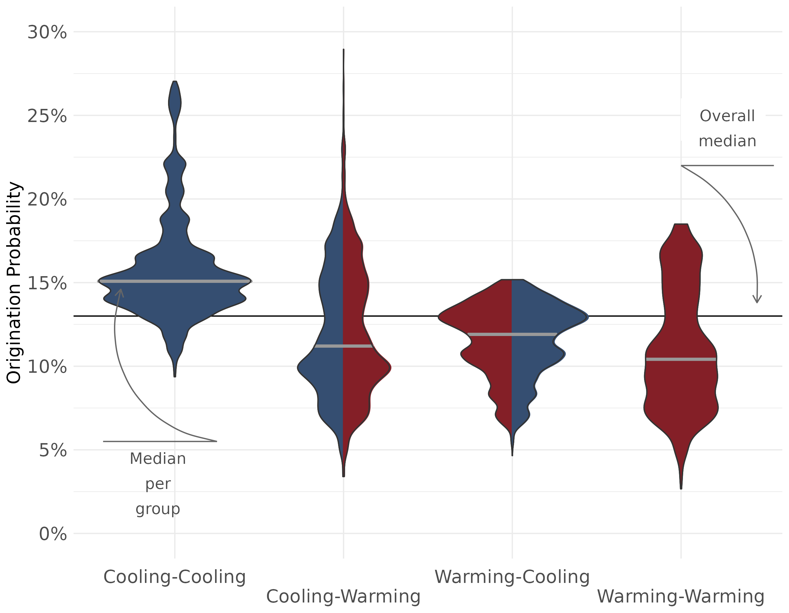
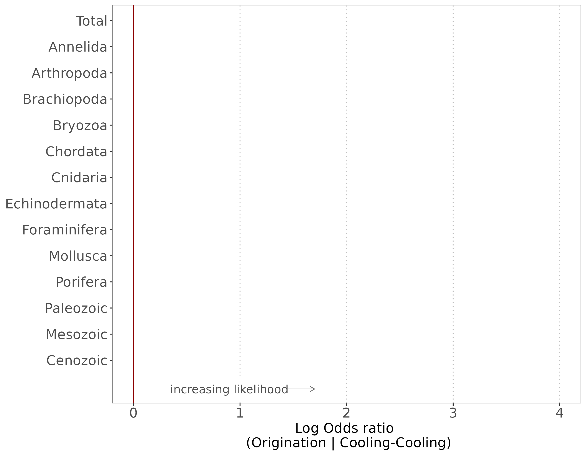
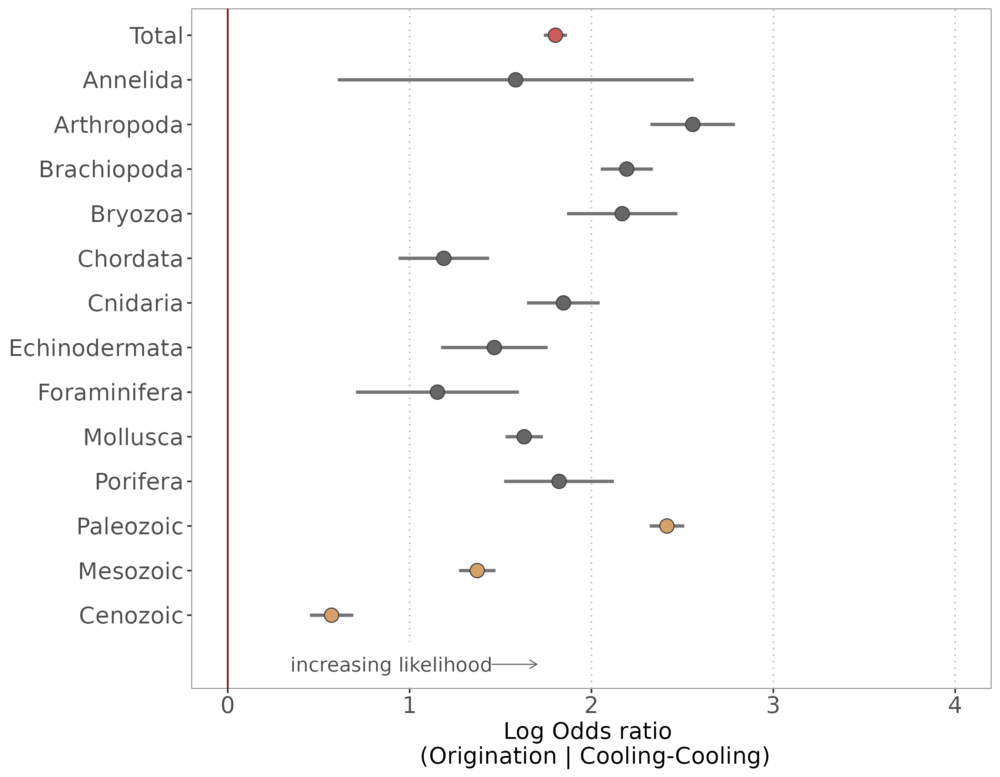

class: bg_karl
## Deep-time climate legacies affect origination rates of marine genera


#### Gregor Hans Mathes <br> Wolfgang Kiessling <br> Manuel Jonas Steinbauer
  

.footnote[
2nd Crossing the Palaeontological – Ecological Gap  
8th September 2021  
Museum für Naturkunde Berlin
]


  
---
class: center
## About me  

.pull-left[
<!--  -->

] 

--

PhD Student  

Tersane  

--

----

Conservation Palaeobiology  
  
Environmental Data Science  

--

----    

Complex interactions of life and climate  
  
Palaeoclimate Interactions  
  


```{r setup, include=FALSE}
options(htmltools.dir.version = FALSE)
library(tidyverse)
```
```{css, echo = F}
.bg_karl {
  position: relative;
  z-index: 1;
}

.bg_karl::before {    
      content: "";
      background-image: url('https://cdn.pixabay.com/photo/2017/02/01/10/23/coral-2029448_960_720.png');
      background-size: cover;
      position: absolute;
      top: 0px;
      right: 0px;
      bottom: 0px;
      left: 0px;
      opacity: 0.1;
      z-index: -1;
}

.remark-slide-number {
  display: none;
}
```

```{r xaringan-themer, include=FALSE, warning=FALSE}
library(xaringanthemer)
style_duo_accent(
  primary_color = "#841F27",
  secondary_color = "#354E71",
  text_font_google  = google_font("Spectral", "300", "300i"),
  code_font_google = google_font("Karla"), 
  text_font_size = "1.18rem" 
)
```  
  
```{r xaringanExtra-search, echo=FALSE}
xaringanExtra::use_search(show_icon = FALSE, 
                          case_sensitive = FALSE)
```  
  
```{r xaringan-tile-view, echo=FALSE}
xaringanExtra::use_tile_view()
```  

```{r xaringan-animate-css, echo=FALSE}
xaringanExtra::use_animate_css()
```


---
## Paleoclimate Interaction

.center[

] 


---
class: animated fadeIn
## Paleoclimate Interaction

.center[

] 

---

## Background  

<br>

Various ecological concepts state that **climatic context** matters for evolutionary dynamics  

--


- niche conservatism<sup>1</sup>  

--

- migration lags<sup>2</sup> 

--

- cascading effects<sup>3</sup>  
 

.footnote[
[1] [Wiens & Graham 2005](http://wienslab.com/Publications_files/Wiens_Graha_m_AnnRev2005.pdf), 
[Hopkins et al. 2014](https://onlinelibrary.wiley.com/doi/pdf/10.1111/ele.12232)  
[2] [Svenning & Skov 2004](https://onlinelibrary.wiley.com/doi/pdf/10.1111/j.1461-0248.2004.00614.x?casa_token=FUNth791jy8AAAAA:3VxiavZdDNQNpkHW6ubiq7BbbMhxZnPvsbMaNksoP3VIDjxfAm132-6hoOb0jVG2XUCPFls8U_UNCQpc), 
[Normand et al. 2011](https://royalsocietypublishing.org/doi/full/10.1098/rspb.2010.2769)  
[3] [Beaugrand 2015](https://royalsocietypublishing.org/doi/pdf/10.1098/rstb.2013.0264), 
[Lord et al. 2017](https://www.int-res.com/articles/feature/m571p001.pdf)
]

---
class: center, middle, animated slideInLeft

  


---
## Recent work 

Biodiversity &#8594; High Impact<sup>1</sup>

Extinction &#8594; High Impact<sup>2</sup>

.footnote[
[1] [Antão et al. 2020, *Nature Ecology and Evolution*](https://www.nature.com/articles/s41559-020-1185-7)

[2] [Mathes et al. 2021a, *Nature Ecology and Evolution*](https://www.nature.com/articles/s41559-020-01377-w)
]

--

# **Origination &#8594; ???**

---
## New publication  
  
- [Mathes et al. 2021b, *PNAS*](https://www.pnas.org/content/118/36/e2105769118)
  
- [Twitter Thread](https://twitter.com/GregorMathes/status/1433723582333530125)  
  
- [Press Release](https://www.uni-bayreuth.de/en/university/press/press-releases/2021/115-evolution-climate-change/index.html)  
  
- [Supplementary Information](https://www.pnas.org/content/pnas/suppl/2021/09/02/2105769118.DCSupplemental/pnas.2105769118.sapp.pdf)

---
### Origination response



---
class: animated fadeIn
### Origination response



---
class: animated slideInLeft

### Effect size
.center[

]

---
class: animated fadeIn
### Effect size

.center[

]

---
class: animated fadeIn
### Effect size

.center[

]

---
### Effect per group



---
class: animated fadeIn
### Effect per group



---
class: bg_karl
### Summary
  
<br/>  
  
.footnote[
Twitter: [@GregorMathes](https://twitter.com/GregorMathes)  
Website: [gregor-mathes.netlify.app](https://gregor-mathes.netlify.app/)
]

--

- **high impact of palaeoclimate interactions on origination**
  
--

- **higher origination signal after cooling-cooling**

--

- **effect consistent in groups and through time**

--
